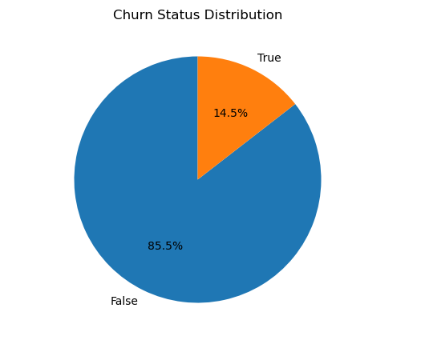
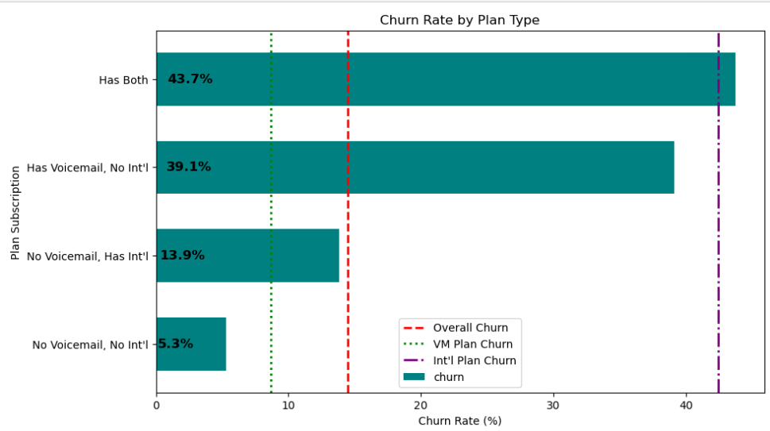
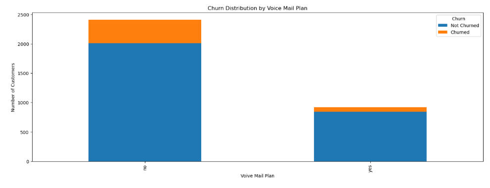
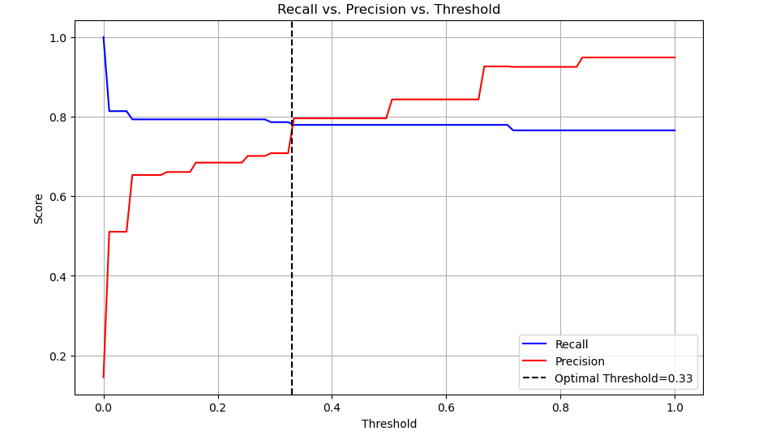
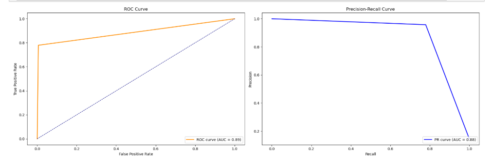
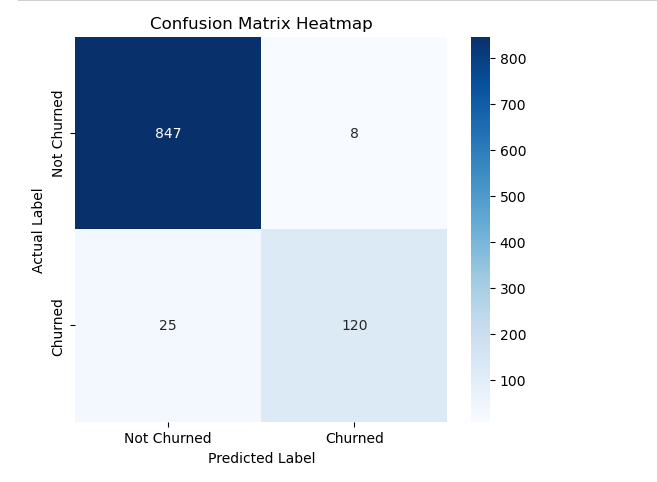

# Predictive Churn Analysis: Optimizing Customer Retention for SyriaTel

# Business Problem
- SyriaTel, like many telecom companies, faces customer churn, where users discontinue their services. This results in:

1. High customer acquisition costs – Retaining customers is more cost-effective than acquiring new ones.
2. Revenue loss – Lost customers reduce recurring revenue and impact profitability.
3. Competitive pressure – Customers can easily switch to competitors.
4. To mitigate these risks, SyriaTel needs a data-driven approach to predict churn and take proactive retention actions.

# Business Objectives
The primary goal is to identify high-risk customers early so SyriaTel can intervene before they leave.

### Key Goals:
1. Predict churn risk to prioritize early intervention.
2. Reduce revenue loss by retaining high-risk customers with targeted incentives.
3. Minimize false negatives to ensure as few actual churners as possible go undetected.

- 📌 Trade-off: SyriaTel prioritizes recall (catching churners) over precision (avoiding false alarms), as missing churners is costlier than wrongly classifying a few loyal customers.

# Data
The dataset consists of 3,333 customer records, containing:

1. Customer details: State, account length, area code.
2. Service plans: International plan, voice mail plan.
3. Usage metrics: Total minutes, total calls, total charge (day, evening, night, international).
4. Customer interactions: Customer service calls.
5. Target variable: Churn (1 = Churned, 0 = Not Churned).
🔗 https://www.kaggle.com/becksddf/churn-in-telecoms-dataset

# Data Understanding
📊 Key Findings:

Churn rate: 14.5% churners, 85.5% non-churners → Class imbalance.

Service plans impact churn:

Customers with an international plan and voice mail plans have a higher churn proportion.

Voice mail plan usage is low, but non-users make up a large part of churners.

Customer service calls are a strong churn predictor – More calls correlate with increased churn.

# Modeling – Major Considerations
1. 🔹 Baseline Model (Logistic Regression) – High accuracy (87%), but recall was only 28%, missing most churners.

2. 🔹 Decision Tree – Improved recall (81%), but overfitting concerns.

3. 🔹 SMOTE for class balancing – Increased false positives, lowering overall model reliability.

4. 🔹 Hyperparameter tuning – Provided minimal gains in performance.

5. 🔹 Random Forest – Best Performing Model

- Final threshold = 0.33 for optimal recall (83%).

- ROC-AUC: 0.91, PR-AUC: 0.90 → Strong model performance.

- Minimized false negatives while keeping false positives under control.

# Conclusion
- ✔ Objective Met: The Random Forest model with threshold 0.33 successfully predicts churn while prioritizing recall.
- ✔ Business Alignment: 83% of churners are correctly identified, allowing timely intervention.
- ✔ Superior Model Performance: High recall (83%), precision (94%), and strong AUC scores.

# Recommendations
- 🚀 Deploy the Random Forest model (Threshold = 0.33) for real-world use.
- 📊 Monitor performance regularly to ensure sustained model accuracy.
- 🔄 Retrain the model with updated data to adapt to evolving customer behavior.
- 🎯 Use feature importance analysis (SHAP) to refine retention strategies.
- 📢 Implement proactive retention efforts based on customer risk scores.